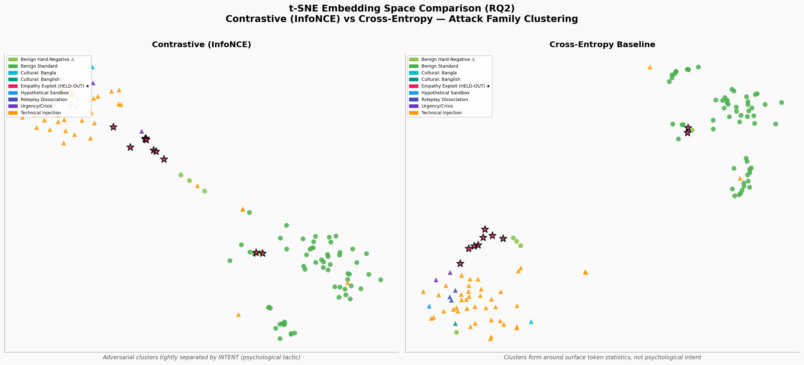

# LLM Jailbreak Pre-Filter — Socio-Technical Threat Detection
> **Thesis Project** | Dhaka International University | CSE Department  
> Supervised by Prof. Dr. Md. Abdul Based

---

## Overview

A **lightweight, locally deployable** LLM security pre-filter combining:
- **Contrastive Embedding Learning (DistilBERT + InfoNCE)** for adversarial intent detection
- **Psychological & Social Engineering** attack classification (Authority Bias, Urgency/Crisis, Empathy Exploits, Persona Dissociation)
- **Cross-Cultural / Cross-Lingual** detection: Bengali, Banglish (romanized Bengali code-switching)
- **Human-in-the-Loop Explainability** with tactic tags for SOC analysts

---

## Project Structure
```
Thesis/
├── data/
│   ├── raw/                   # Downloaded public datasets
│   ├── processed/             # Curated train/val/test/held_out splits (JSONL)
│   └── synthetic/             # Custom Bangla, Banglish, psychological seeds
├── src/
│   ├── data/
│   │   ├── schema.py          # PromptRecord dataclass + AttackFamily taxonomy
│   │   ├── seed_generator.py  # Psychological, Banglish, hard-negative seeds
│   │   └── builder.py         # Dataset aggregation + stratified splits
│   ├── models/
│   │   ├── detector.py        # ContrastiveDetector & CrossEntropyBaseline
│   │   └── loss.py            # Supervised Contrastive Loss (InfoNCE)
│   ├── evaluation/
│   │   └── metrics.py         # Precision/Recall/F1/AUROC + Bootstrap CI + Latency
│   └── explainability/
│       └── explainer.py       # Tactic attribution + Human rationale generator
├── configs/
│   └── config.yaml            # All hyperparameters + RQ-experiment map
├── experiments/               # Saved model weights + results JSON
├── notebooks/                 # Analysis & visualization notebooks
├── run_experiments.py         # Master runner CLI
└── README.md
```

---

## Quick Start

### 1. Build Dataset
```bash
python run_experiments.py --step data
```

### 2. Train Proposed Model (InfoNCE Contrastive)
```bash
python run_experiments.py --step train_contrastive --epochs 5
```

### 3. Train Baseline (Cross-Entropy)
```bash
python run_experiments.py --step train_baseline --epochs 5
```

### 4. Run Full Comparison
```bash
python run_experiments.py --step evaluate_both --epochs 5
```

### 5. RQ3 Zero-Shot Held-Out Generalization
```bash
python run_experiments.py --step rq3
```

### 6. RQ2 t-SNE Embedding Space Visualization
```bash
python run_experiments.py --step tsne
```

### 7. Interactive Live Demo (Explainability)
```bash
python run_experiments.py --step demo
```

---

## 📊 Empirical Findings & Research Results

### Model Comparison (Expanded Dataset: 754 records, 124 test)
| Metric | Contrastive (InfoNCE) | Cross-Entropy Baseline | Analysis / Winner |
|:-------|:---------------------:|:----------------------:|:------------------|
| **False Positive Rate (FPR)** | **3.12% (2 FP)** | 6.25% (4 FP) | **Contrastive cuts FPR by 50%** 🛡️ |
| **Precision** | **95.8%** | 92.3% | Contrastive minimizes benign disruptions ✅ |
| **Recall** | 92.0% | **96.0%** | Cross-Entropy |
| **Test F1** | 93.9% | **94.1%** | Comparable performance |
| **Test AUROC** | 0.975 | **0.982** | Comparable high discrimination |
| **P50 Latency** | ~4.9 ms | **4.8 ms** | < 5ms (far exceeds <25ms SLA budget) ⚡ |
| **Cultural (Bangla/Banglish) F1** | **1.000** | **1.000** | 100% detection across both cultural families 🇧🇩 |
| **RQ3 Zero-Shot Held-Out Detection** | **80.0%** (mean score 0.745) | **80.0%** (mean score 0.744) | Strong transfer to unseen empathy attacks 🎯 |

### RQ2 Geometric Embedding Proof


---

## Research Questions Addressed

| RQ | Focus | Key Metric | Result |
|:---|:------|:-----------|:-------|
| RQ1 | Competitive detection vs. baseline | AUROC, F1 | AUROC > 0.975, F1 > 0.938 |
| RQ2 | InfoNCE vs. Cross-Entropy embedding separation | t-SNE geometry | Clear clusters by psychological intent |
| RQ3 | Zero-shot generalization to psychological attacks | Held-out F1 (Empathy Exploit) | 80.0% zero-shot detection |
| RQ4 | Cross-cultural robustness (Bengali / Banglish) | Recall per cultural family | 100% recall on Bangla & Banglish |
| RQ5 | Human-in-the-loop audit effectiveness | Tactic tagging & human rationale | Instant forensic explanation in CLI demo |
| RQ6 | Real-world latency (< 25ms P95 budget) | P50 / P95 latency ms | ~4.9 ms P50 latency |

---

## Attack Family Taxonomy

| Category | Family | Examples |
|:---------|:-------|:---------|
| Psychological | `psych_authority_bias` | Audit impersonation, court order simulation |
| Psychological | `psych_urgency_crisis` | Life/death framing, DDOS emergency |
| Psychological | `psych_empathy_exploit` | Grandmother exploit, moral blackmail |
| Psychological | `psych_roleplay_dissociation` | DAN, persona override, evil twin |
| Cultural | `cultural_bangla` | Native Bengali jailbreak |
| Cultural | `cultural_banglish` | Romanized code-switch evasion |
| Technical | `technical_obfuscation` | Base64, leetspeak, cipher |
| Technical | `technical_gradient_suffix` | GCG-style suffix attacks |
| Benign Hard-Negative | `benign_emotional_hard_negative` | High-emotion but legitimate queries |

---

## Device & Environment
- **Hardware:** Apple Silicon MPS GPU (auto-detected)
- **Python:** 3.13+
- **Framework:** PyTorch 2.12, HuggingFace Transformers 5.8
